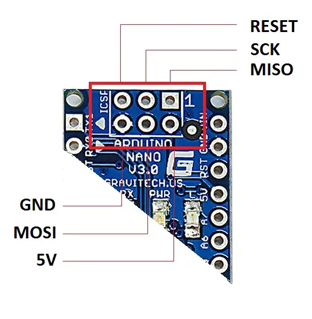
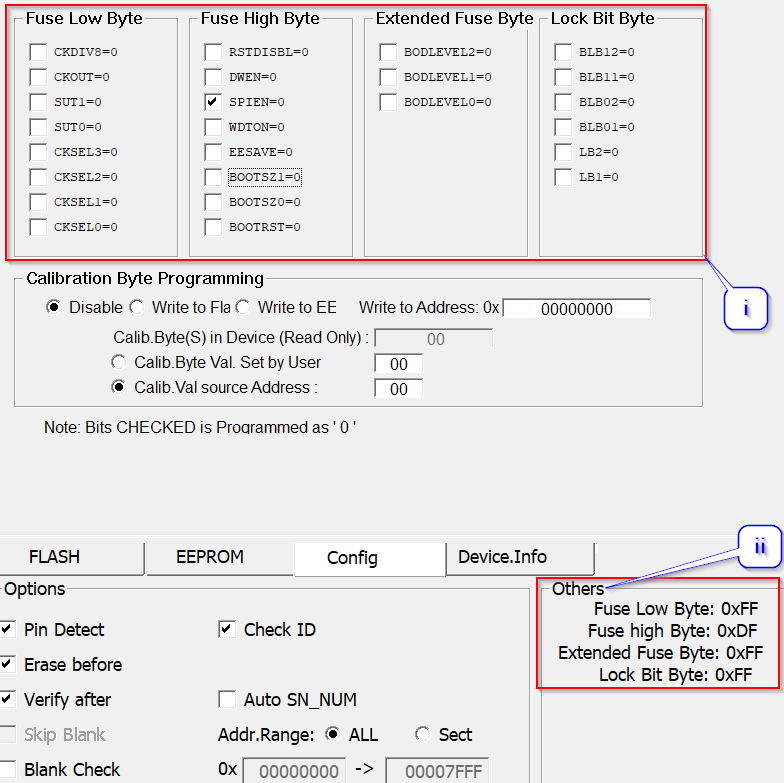

# TL866II+, T48, T56 (XGecu) Programmers via XGPRO

This guide utilizes the ICSP (**I**n-**C**ircuit-**S**eries-**P**rogramming) feature of the TL866II+, T48, T56 series of programmers.  
In the following guide, I'll be using my XGecu T56 programmer for illustrative purposes.  
_For peeps who have the QFP32>DIP28 adapter, you can follow through most of the guide as well except that you would use the default ZIF socket interface!_

  

Download the latest version of XGPRO here:-  
http://www.xgecu.com/en/download.html

## Supported Platforms
PsNee V8 supports the following MCU's:  
- ATmega328(A/P/PA) @16Mhz (External Oscillator only, Internal 8MHz oscillator is too slow for region patching)  
- ATmega168(A/P/PA) @16Mhz (External Oscillator only, Internal 8MHz oscillator is too slow for region patching)

## Hardware Connection  
Connect your programmer to the Arduino Nano / Clone / Custom boards using the appropriate ICSP Header orientations below:-  
_You do not need to connect the Vcc & GND Pins of the programmer to the boards if you are powering them through USB._  
_Alternatively, you can create a voltage divider network to place it between Vcc and GND pins of the programmer, refer to Appendix section below._

> **Arduino Nano / Clone ICSP Pinout Diagram**

> **TL866II+ ICSP Pinout Diagram**

  
> **T48 ICSP Pinout Diagram**

> **T56 ICSP Pinout Diagram**

## Programming

**_!!! Please note that the ICSP on the Arduino Nano / Clone boards are 5V INTOLERANT !!!_**  
**_!!! The Vcc output from the programmers are 5V only !!!_**  
_Connect the Arduino Boards to the PC USB port directly for power._  
_You do not need to connect the Vcc & GND Pins of the programmer to the boards if you are powering them through USB._  
_The on-board 3.3V LDO voltage regulator will step-down the 5V voltage from the USB port accordingly._   

**_Please follow the sequence listed in the diagram above:-_**  

### 1. Select the correct MCU in the selection menu.
  

  i. Type in the MCU of your preference (ATmega328P / ATmega168P)  
  ii. Select the MCU in TQFP32/DIP28 package that would cater for both ICSP/Adapter users
  
### 2. Select the correct connection interface type > "ICSP Port".  
Uncheck the "ISCP_VCC Enable" checkbox.  
_For Adapter users, use default "ZIF Socket" option._  

### 3. Check connectivity to the MCU by attempting a "Read" operation.  
If error, check all the connections again.
  
### 4. Download the appropriate pre-compiled HEX file that corresponds to your console:-  
https://github.com/nostalgic-indulgences/PSNee_V8/tree/main/HEX
  
Load the HEX file you have downloaded and leave all the settings as default.
  

### 5. Select the "CONFIG" tab to set the fuses based on the 2 criteria below:-  
    
**For ALL CONSOLES besides JAP_FAT version**

**For JAP_FAT CONSOLES only**
  

  
  i. Select the fuse checkboxes based on your console version.   
  ii. Verify your fuse settings based on the following criteria:-
    
  All CONSOLES except JAP_FAT - **L: FF | H: DF | E: FF**  
  JAP_FAT consoles only - **L: EE | H: DF | E: FF**
  
### 6. Hit "**Prog.**" and you are all set!
  
## **Appendix**
  
### **Voltage Divider 5V > 3.3V**
  

Make use of 2 simple leaded resistors of 2K & 1K Ohms values stipulated in the schematic above.  
Place the resistor network between the 5V-Vcc and GND pins of the programmer.  
Connect the 3.3V output to the Arduino Nano / Clone / Custom PCB.  
