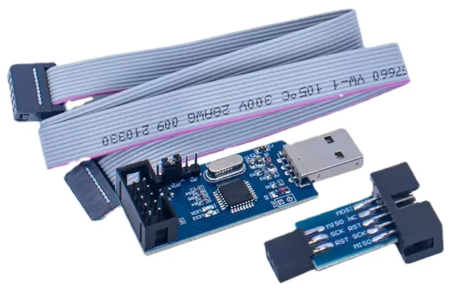
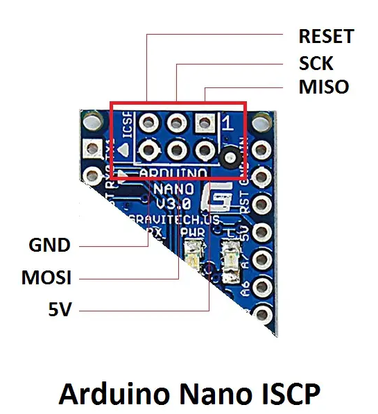
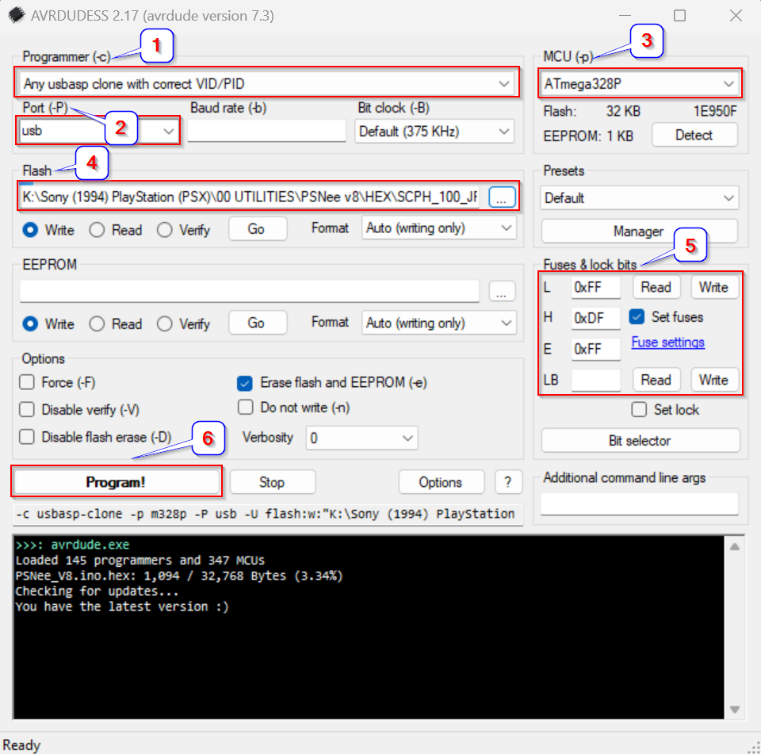

# USBasp via AVRDUDESS

This guide utilizes the USBasp programmer that you can readily get off AliExpress or Amazon.  
Ensure it's the USBasp version with the 10-pin > 6-pin adapter, and not the USBISP variety.  
**_!!! DO NOT GET THE VERSION WITH ALUMINIUM SHELL !!!_**

  

Install the usb drivers using Zadig for the USBasp programmer by following the steps here:-  
https://www.instructables.com/USBASP-Installation-in-Windows-10/

Download the latest version of AVRDUDESS here:-  
https://blog.zakkemble.net/avrdudess-a-gui-for-avrdude/  

## Supported Platforms
PsNee V8 supports the following MCU's:  
- ATmega328(A/P/PA) @16Mhz (External Oscillator only, Internal 8MHz oscillator is too slow for region patching) 
- ATmega168(A/P/PA) @16Mhz (External Oscillator only, Internal 8MHz oscillator is too slow for region patching)

## Hardware Connection  
Connect the USBasp programmer to the Arduino Nano / Clone / Custom PCB using the corect ICSP (**I**n-**C**ircuit-**S**eries-**P**rogramming) Header orientation below:-  

## Programming

Please follow the sequence in the diagram above.
1. Select the correct programmer in the dropdown list
2. Select the correct port > usb
3. Select the correct MCU > ATmega328P / ATmega168P
4. Select the correct pre-compiled HEX file that corresponds to your console:-
- https://github.com/nostalgic-indulgences/PSNee_V8/tree/main/HEX
5. Set your fuses based on the following criteria and ensure the "set fuses" checkbox is selected:- 
- JAP_FAT consoles: **L: EE | H: DF | E: FF**  
- All other consoles: **L: FF | H: DF | E: FF**
6. Select the tickbox to erase the flash of the MCU
7. Hit "**Program!**" and you are all set!
